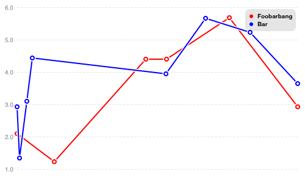
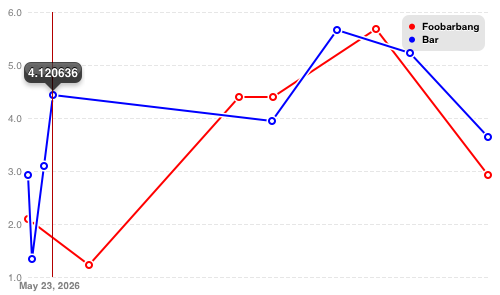

# ios-linechart
Interactive linecharts for the simplicity-loving iOS developer.

You just want some linecharts, and Core Plot makes you think


Search no more! ios-linechart is here!

## Features
- Simple API. Lets you draw the first chart by the time you would need to find sample code for Core Plot.
- Interactivity. Lets users look at single datapoints.
- Support non-uniform steps on the x axis

## Installation

### CocoaPods
The best way to get ios-linechart is to use [CocoaPods](http://cocoapods.org/). 

### Without CocoaPods

If, for some reason, you don't want that, copy the following files into your project:

* `LCLegendView.h`, `LCLegendView.m`
* `LCLineChartView.h`, `LCLineChartView.m`
* `LCInfoView.h`, `LCInfoView.m`

Additionally, you will need to get some dependencies from the [objc-utils](https://github.com/mruegenberg/objc-utils) project:

* `UIKit+DrawingHelpers.{h,m}` (found in `UIKit/Drawing/`)

Just copy these into you project as well.

ios-linechart uses Core Graphics, so you'll need to add `CoreGraphics.framework` to your project.

Even if you don't use Cocoapods, it is recommended to use an official release, since the repository may be unstable in  between releases. Just check out the newest tagged commit.


## Usage

Basic usage can be seen in the demo app contained in the repository.

First, import the main header:

```obj-c
    #import "LCLineChartView.h"
```

Alternatively, you can import the abbreviation header, which provides names without the `LC` prefix:
```obj-c
    #import "LineChart.h"
```
    
Each chart line is contained in a `LCLineChartData` object, which specifies a range of its data on the x axis (`xMin` / `xMax`), a `color`, a `title` (which is displayed in the legend) and an `itemCount`, the number of data points:

```obj-c
    LCLineChartData *d = [LCLineChartData new];
    d.xMin = 1;
    d.xMax = 31;
    d.title = @"The title for the legend";
    d.color = [UIColor redColor];
    d.itemCount = 10;
```
    
Additionally, each `LCLineChartData` object also has a `getData` property. This is simply a block that takes the number of a data point as its     argument and returns `LCLineChartDataItem` objects, which wrap the individual data points:

```obj-c
    NSMutableArray *vals = [NSMutableArray new];
    for(NSUInteger i = 0; i < d.itemCount; ++i) {
        [vals addObject:@((rand() / (float)RAND_MAX) * (31 - 1) + 1)];
    }
    [vals sortUsingComparator:^NSComparisonResult(id obj1, id obj2) {
        return [obj1 compare:obj2];
    }];
    d.getData = ^(NSUInteger item) {
        float x = [vals[item] floatValue];
        float y = powf(2, x / 7);
        NSString *label1 = [NSString stringWithFormat:@"%d", item];
        NSString *label2 = [NSString stringWithFormat:@"%f", y];
        return [LCLineChartDataItem dataItemWithX:x y:y xLabel:label1 dataLabel:label2];
    };
```
    
The `x` and `y` properties of `LCLineChartDataItem` are, obviously, the x and y values of the data point. `xLabel` is the text displayed on the x axis when the data point is selected, `dataLabel` is usually just a textual representation of the y value, and is displayed in a bubble directly next to the data point when the user touches it.

Note that, to get a coherent chart, the x values for the items should be sorted. This will be the case anyway for most real-world data. 

Finally, everything is packed up into a `LCLineChartView`:

```obj-c
    LCLineChartView *chartView = [[LCLineChartView alloc] initWithFrame:CGRectMake(20, 700, 500, 300)];
    chartView.yMin = 0;
    chartView.yMax = powf(2, 31 / 7) + 0.5;
    chartView.ySteps = @[@"0.0",
                         [NSString stringWithFormat:@"%.02f", chartView.yMax / 2],
                         [NSString stringWithFormat:@"%.02f", chartView.yMax]];
    chartView.data = @[d];

    [self.view addSubview:chartView];
```
    
The `yMin` and `yMax` properties should be self-evident. `ySteps` is an array of labels which are placed along the y axis. `data` is an array of all `LineChartData` objects to use. `drawsDataPointOrnaments` is a switch that determines whether circles are drawn around the actual data points.

## Screenshots




## FAQ

- *The sample project doesn't compile*

  The sample project, at the moment, needs CocoaPods. Install Cocoapods, then run `pod install` while you are in the ios-linechart directory.
  
- *Will the project support bar charts, pie charts, ...?*

  No.

## Contact


Bug reports and pull requests are welcome! Contact me via e-mail or just by opening an issue on GitHub.
